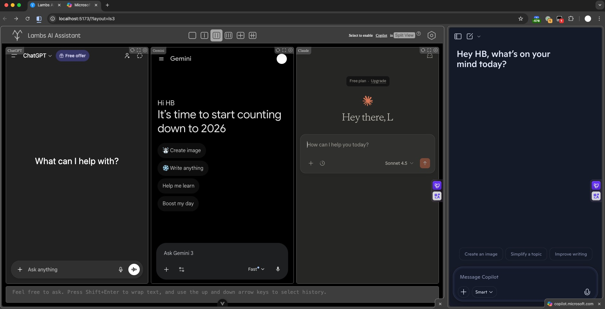

# Lambs AI Assistant

English | 简体中文(README.md)

The Lambs AI Assistant is a pure front-end webpage that aggregates web portals from various AI websites, allowing users to simultaneously ask questions to multiple AI agents.  
This is the official website of Lambs AI Assistant[https://lambs-ai.com]



Before using the Lambs AI assistant, you need to install a Google Chrome or Edge browser plugin: [Click Here](./xmy-ai-web/public/xmy-ai-chrome-plugin.7z)

- After downloading, extract the plugin to a specific folder
- Open the Chrome extension management interface (Settings - Extensions - Manage Extensions)
- Enable developer mode, as shown below
- Click to load the unpacked extension, and select the unzipped folder, as shown in the above figure
- Open or refresh the Lambs AI assistant[https://lambs-ai.com]

Note: The interface of the Lambs AI Assistant does not allow login or logout actions. If you need to log in or log out, please open a separate interface to do so. The assistant will automatically synchronize account information (follow the prompts within the assistant if necessary).

The Lambs AI Assistant specifically supports the split view mode: webpages in split view mode present completely independent interfaces, ensuring that any plug-in can function normally. Additionally, some limitations imposed by iframes can be disregarded.

For the Edge browser, it's called a split screen, and there is a limitation: the Lambs AI assistant must be on the right side of the split window.

## Feature

- Ask multiple AI questions simultaneously
- Allow customization of AI and custom configuration
- Provide Android APP

## Seeking a Star

## Modify AI configuration and add new AI entry points

For the AI portal, Little Sheep Assistant highly supports customization. Those who are capable can give it a try and share their achievements.  
Custom AI is configured in the main interface of the Lambs AI Assistant - under the AI dropdown list - in the "More" section.
This is a typical AI entry configuration:

```javascript
{
  "key": "tongyi",
  "name": "QianWen",
  "extraCsp": [
    "https://www.tongyi.com/"
  ],
  "url": "https://www.qianwen.com/",
  "cookies": [
    "tongyi_sso_ticket"
  ],
  "fromChina": true,
  "sendMsg": async function(msg) {
    const el = await findEl("textarea.ant-input");
    setValue(el, msg);
    emitEnter(el);
  },
}
```

- key Required Unique
- name Required
- url Required Current AI address, please manually remove unnecessary parameters
- extraCsp Optionally, for each AI entry, the Little Sheep plugin will remove the CSP response header for its URL to allow it to be accessed within an iframe.
  extraCsp Used to specify which URLs, besides the current one, require CSP removal. Generally, this field is not required
- cookies The Lambs AI Assistant does not support login itself, but it utilizes cookies from websites that have already been logged in. Most of the time, websites use the Lax option of cookies to restrict iframes from obtaining their cookies. This option represents the Token required to log in to the AI website
- storage This option represents the Token required to log in to the AI website
- sendMsg How to send a message? This configuration will be executed within the interface of the target AI website. For specific built-in methods, please refer to aioHelpers in [aios.ts](./xmy-ai-web/src/state/aios.ts)
