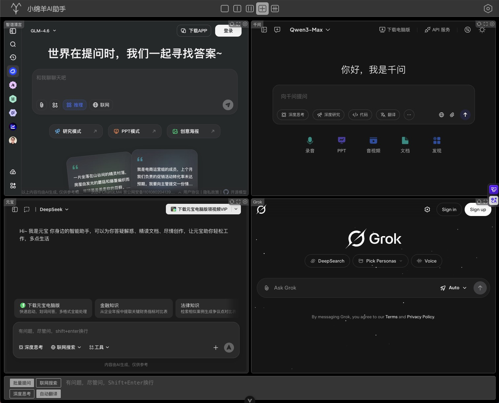
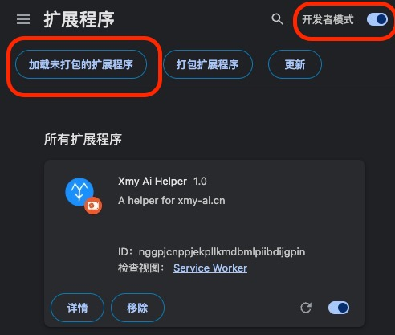

# 小绵羊 AI 助手

小绵羊 AI 助手是一个纯前端网页，它聚合了利用各大 AI 网站的 Web 端入口，可以同时向多个 AI 智能体提问。  
这是小绵羊 AI 助手的官方网站[https://xmy-ai.cn]



使用小绵羊 AI 助手前，需要安装一个谷歌,Edge 浏览器插件：[点此下载](./README/xmy-ai-chrome-plugin.7z)

- 下载后，将插件解压至某文件夹
- 打开 Chrome 管理扩展程序界面(设置-扩展程序-管理扩展程序)
- 启用开发者模式，如下图
- 点击加载未打包的扩展程序，选择解压后的文件夹，如上图
- 打开或刷新小绵羊 AI 助手[https://xmy-ai.cn]

注意：小绵羊 AI 助手的界面中是无法进行登陆登出动作的，如果须要登陆，登出，请打开单独界面进行。助手会自动同步账号信息（必要时根据助手内提示操作）。

小绵羊 AI 助手特别支持拆分视图模式：拆分视图模式下的网页是完全独立的界面，这意味着任意插件都能正常运行，另外 iframe 存在的一些限制也可忽略。因为目前谷歌浏览器拆分视图仅支持额外的一个网页，所以小绵羊暂时也就仅支持一个拆分视图。

## 求 Star

小绵羊 AI 助手目前仅开源了谷歌插件部分和 APP 部分，Web 端的代码将在 1K Star 之后开源。

## 更改 AI 配置与新增 AI 入口

对于 AI 入口，小绵羊助手高度支持自定义，有能力的同学可以试一试并分享你的成果。  
自定义 AI 是在小绵羊 AI 助手的主界面-AI 下拉列表-更多中配置的。  
这是一个典型的 AI 入口配置：

```javascript
{
  "key": "tongyi",
  "name": "千问",
  "extraCsp": [
    "https://www.tongyi.com/"
  ],
  "url": "https://www.qianwen.com/",
  "cookies": [
    "tongyi_sso_ticket"
  ],
  "fromChina": true,
  "sendMsg": async function(msg) {
    const el = await findEl("textarea.ant-input");
    setValue(el, msg);
    emitEnter(el);
  },
}
```

- key 必填 且唯一
- name 必填 名称
- url 必填 当前 AI 地址，请手动移除不必要的参数
- extraCsp 可选，对于每一个 AI 入口，小绵羊插件都会为其 url 移除 CSP 响应头以允许其在 iframe 内访问。
  extraCsp 用于指定除了当前 url 以外，还有哪些 url 须要移除 CSP，一般无需填写
- cookies 小绵羊 AI 助手本身不支持登陆，但它使用已登陆网站的 cookie，大多数时候，网站会使用 Cookie 的 Lax 选项来限制 iframe 获取其 cookies，该选项代表登陆 AI 网站所需要的 Token
- storage 该选项代表登陆 AI 网站所须要的 Token
- sendMsg 如何发送消息，该配置会在目标 AI 网站的界面内执行 具体内置的方法见 [aios.ts](./xmy-ai-web/src/state/aios.ts)

## TODO List

| 项目　　　　 | 完成情况 |
| ------------ | -------- |
| 基础功能　　 | ✅       |
| 主题　　　　 | ✅       |
| 状态存储　　 | ✅       |
| 提问历史记录 | ✅       |
| 深度思考　　 | ✅       |
| 联网搜索　　 | ✅       |
| 自动翻译　　 | ✅       |
| 提示词前缀　 | ✅       |
| 小屏模式　　 | ✅       |
| 多窗口多布局 | ✅       |
| 更多智能体　 | ✅       |
| 自定义智能体 | ✅       |
| 放大功能　　 | ✅       |
| 新标签页打开 | ✅       |
| 新用户引导　 | ✅       |
| 拆分视图模式 | ✅       |
| 各种弹窗　　 | ✅       |
| 重置设置　　 | ✅       |
| 高级设置　　 | ⛔       |
| 校验设置　　 | ⛔       |
| 合并设置　　 | ⛔       |
| 账号　　　　 | ⛔       |
| 国际化　　　 | ⛔       |
| 问答历史记录 | ⛔       |
| 客户端　　　 | ⛔       |
| 低分辨率适配 | ✅       |
| 安卓　　　　 | ✅       |
| 苹果？　　　 | ⛔       |
